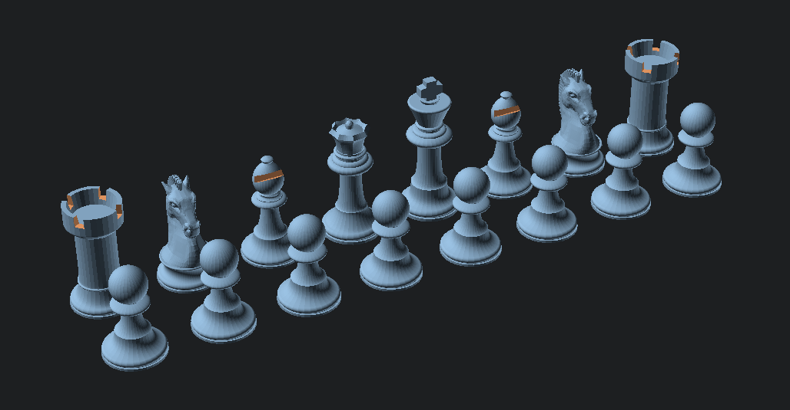

# scad-chess

An open source chess set, made with openSCAD

Forked from [scad-chess](https://github.com/quaternionmedia/scad-chess)
which was forked from [OpenSCAD Chess Simple Printing](https://www.thingiverse.com/thing:3381939)
which was forked from [OpenSCAD Chess](https://www.thingiverse.com/thing:585218)

This fork cleans up the sizes and fixes the profiles for easier FDM printing ; also helps getting pieces of the correct size based on the chess board.

## Printing

I recommend printing with 2 shells, zero bottom layers, 0% fill (or 5% gyroid) and then filling the pieces with some material such as plaster or cement to give them a nice and comfortable weight, finishing with a pad of felt underneath. A magnetic base is also an option for travel sets.

## Fun facts

While working on this, I stumbled on
* a problem with the size of the parts (due to changes between OpenSCAD versions)
* a bug in GitHub (uploading an image, then moving the resulting URL within the text area deletes the image)
* a bug in Inkscape (path vertices extending in the *x* negative range when aligned with the page) - or maybe it's a bug in OpenSCAD?
* a bug in Prusa Slicer (perimeters marked as overhanging when they shouldn't be)
