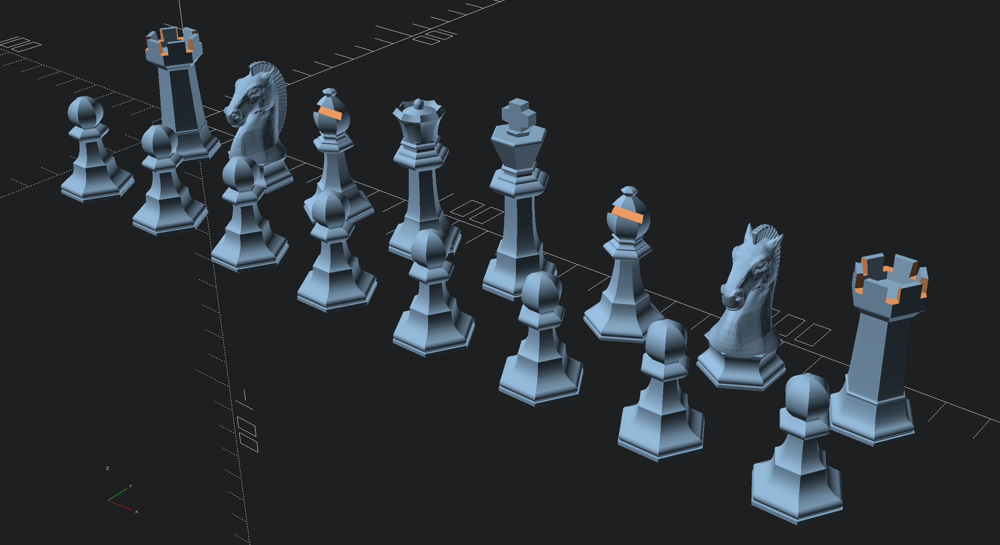

# scad-chess

An open source chess set, made with openSCAD

## Design goals
This project aims to create a chess set that is:
* Parametric
* Easy to modify and customize pieces
* Easy to scale pieces, or the whole set
* Easy to print on FDM 3D printers

## Customization
Each piece can be editied individually in the `chess_{piece}.scad` file, or the whole set can be modified at once in `chess_set.scad`.

### Parameters
Each piece has individual parameters as documented, but all pieces share the following parameters:

- `SCALE` - scale factor for the whole set
- `$fn` - number of faces

#### Examples
Setting `$fn=4` makes square pieces

Setting `$fn=6` makes hexagonal pieces

Setting `$fn=64` (or greater) makes (approximately) circular pieces

## Printing
The pieces are designed to be printed as-is, without supports, with or without infill.

### Filling
For a more solid feel, the pieces can be printed hollow and filled with a material such as plaster or cement. This gives them a nice and comfortable weight, optionally finishing with a pad of felt underneath. A magnetic base is also an option for travel sets.

## Fun facts
While working on this, I stumbled on
* a problem with the size of the parts (due to changes between OpenSCAD versions)
* a bug in GitHub (uploading an image, then moving the resulting URL within the text area deletes the image)
* a bug in Inkscape (path vertices extending in the *x* negative range when aligned with the page) - or maybe it's a bug in OpenSCAD?
* a bug in Prusa Slicer (perimeters marked as overhanging when they shouldn't be, on pawns)
* yet another bug in Prusa Slicer (pawns with `$fn = 5` were missing most of the bottom 4 layers, even with solid bottom layers)

For some reason I'm having trouble finding this fun anymore...

## Contributors
- [Tim Edwards](https://www.thingiverse.com/timedwards/designs) - [OpenSCAD Chess](https://www.thingiverse.com/thing:585218)
- [Dan Michitsch](https://www.thingiverse.com/zarlor/designs) - [OpenSCAD Chess Simple Printing](https://www.thingiverse.com/thing:3381939)
- [Harpo](https://harpo.me/) - [scad-chess](https://github.com/quaternionmedia/scad-chess)
  - Designed for [launchchess](https://www.quaternion.media/launchchess), scaled to play on Novation Launchpad devices
- [engrenage](https://github.com/petaflot) - [scad-chess](https://github.com/petaflot/scad-chess)
  - Designed for [PChess](https://github.com/petaflot/pchess), a 3+ player hexagonal chess variant

## License
This project is licensed under a Creative Commons Attribution 4.0 License (CC BY 4.0)
